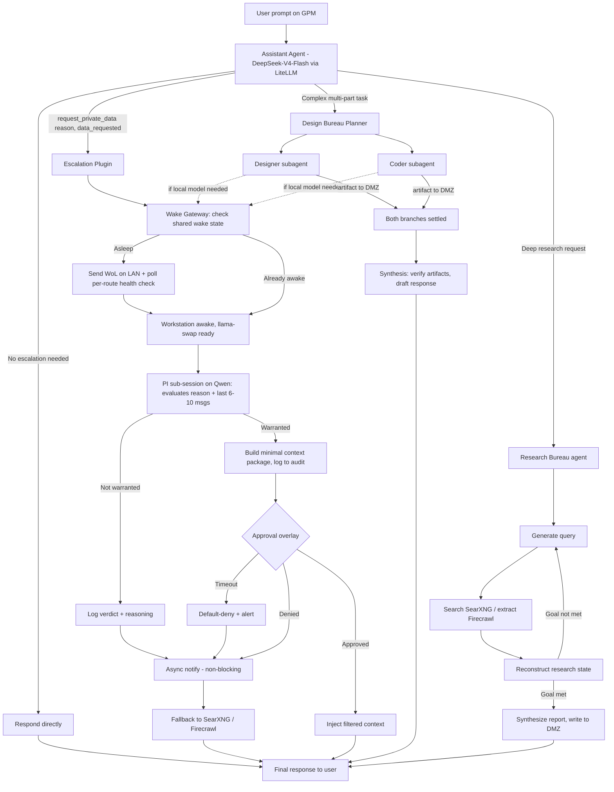
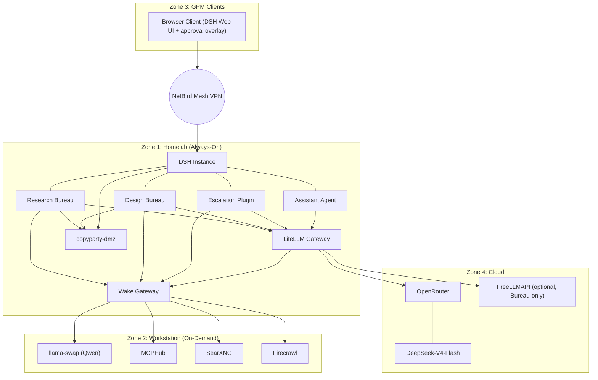

# Hubble — Multi-Tier Agent Infrastructure Architecture (v2.0)

*Hubble is the name for the whole system described in this document: a self-hosted, privacy-boundary-respecting multi-agent infrastructure spanning a 24/7 Homelab control plane, an on-demand GPU Workstation, and remote client devices. This version supersedes Setup_v1.1.md — it adds the Research Bureau, settles the concurrency-framework question for both bureaus, and adds sourced references throughout so any reader (human or agent) can independently verify every design choice against the primary source.*

---

## Changelog from v1.1

- **Added the Research Bureau**: a single-agent, IterResearch-style iterative search/extract/synthesize loop, modeled on the publicly documented behavior of PewDiePie's Odysseus project, running as its own Cordis plugin alongside the Design Bureau.
- **Settled on custom concurrency code for both bureaus**, not XState and not LangGraph. Design Bureau's fan-out/join and Research Bureau's single-agent loop are each simple enough that a framework isn't earning its keep yet; both call into one small shared internal background-job utility instead.
- **Added FreeLLMAPI as an optional, named LiteLLM backend** for Design Bureau Builder subagents and Research Bureau's per-round calls — not for the Assistant or the PI.
- **Added a full stack reference table** (section 13) with a link to the primary source (repo, docs, or paper) for every non-trivial technology choice in this document.

---

## System Overview

Hubble combines a 24/7 low-power Homelab control plane, an on-demand high-performance GPU Workstation, and remote General Purpose Machines (GPMs), connected via a NetBird mesh VPN. A single DSH (DeepSeek Harness) instance on the Homelab runs four custom Cordis plugins:

1. **Assistant Agent** — the everyday chat driver, DeepSeek-V4-Flash via OpenRouter, reached through LiteLLM.
2. **Escalation Plugin** — the privacy gate: spins up a local Qwen-based **Private Investigator (PI)** session whenever the Assistant decides it needs private data, gated by your approval.
3. **Design Bureau** — a Planner that dispatches Designer/Coder Builder subagents in parallel for complex, multi-part creative/coding tasks.
4. **Research Bureau** — a single self-looping agent that runs deep, multi-round web research, modeled on IterResearch's Markovian workspace-reconstruction pattern.

Everything downstream of the DSH instance — model access, waking the Workstation, artifact storage — is shared, general-purpose infrastructure, not duplicated per plugin.

For now, for ease of testing, the entire stack (Homelab-tier and Workstation-tier services alike) runs on the single Workstation machine. The architecture below is written as if the tiers are already split, because that split is the target end-state — see the companion `BUILD_GUIDE.md` for how single-machine-now becomes multi-machine-later without a rewrite.

---

## Network Overlay: NetBird

- **What it is:** [github.com/netbirdio/netbird](https://github.com/netbirdio/netbird) — a WireGuard-based, peer-to-peer mesh VPN with zero-trust access controls.
- **Role in Hubble:** connects Homelab, Workstation, and GPMs into one encrypted `10.x.x.x` network. All inter-machine traffic moves across this tunnel instead of open port forwarding on the home router.
- **Known limit:** Wake-on-LAN magic packets are Layer 2 broadcasts and do **not** traverse this Layer 3 overlay. The Wake Gateway (section 8) sends WoL on the physical LAN, not over NetBird.

---

## Zone 1: Homelab (Tier 1 — Always-On Control Plane)

Runs, always on:

- **`dsh-instance`** — DeepSeek Harness itself: Web UI, Cordis plugin runtime, session/event log. This *is* the orchestrator (section 6).
- **`litellm-gateway`** — the single model-access point for every plugin (section 7).
- **`wake-gateway`** — generalized reverse proxy that wakes and forwards to Workstation-hosted services (section 8).
- **`copyparty-dmz`** — [github.com/9001/copyparty](https://github.com/9001/copyparty), a 100GB shared directory the Cloud Assistant and both Bureaus can read/write directly, without PI review.
- **`netbird-node`** — maintains the mesh connection.

---

## Zone 2: Workstation (Tier 2 — On-Demand Compute & Vault)

Woken on demand via the Wake Gateway:

- **`llama-swap`** ([github.com/mostlygeek/llama-swap](https://github.com/mostlygeek/llama-swap)) — OpenAI-compatible endpoint, port 8080. Loads `Qwen 2.5 27B GGUF` for the PI session and swaps to `nomic-embed-text GGUF` when idle. Its own model-unload TTL only frees VRAM — it has no opinion about the whole machine sleeping (see section 8).
- **`MCPHub`** — aggregator/SSE endpoint for local tools (Blender, Adobe suite, file scanner), speaking the [Model Context Protocol](https://github.com/modelcontextprotocol/modelcontextprotocol).
- **`SearXNG`** ([github.com/searxng/searxng](https://github.com/searxng/searxng)) — self-hosted metasearch; primary search backend for both the Escalation Plugin's web fallback and the Research Bureau.
- **`Firecrawl`** ([github.com/mendableai/firecrawl](https://github.com/mendableai/firecrawl)) — self-hosted scraping/crawling API, for deeper page fetches than a search snippet.
- **`workspace-cli-vault`** — local email/calendar/filesystem index access, reachable only by the PI session.
- **`netbird-node`** — joins the mesh on boot, after Wake-on-LAN.

---

## Zone 3: GPM Clients (Tier 3 — Client Edge)

- **Browser client** — connects to the DSH Web UI over NetBird; renders the **approval overlay**, a first-class DSH/Cordis UI concept for gating a tool call behind a human yes/no.
- **`netbird-client`** — background VPN client on remote devices.

---

## Zone 4: Cloud & External

- **OpenRouter** ([openrouter.ai](https://openrouter.ai)) — reached only via LiteLLM, proxies to DeepSeek-V4-Flash.
- **FreeLLMAPI** ([github.com/tashfeenahmed/freellmapi](https://github.com/tashfeenahmed/freellmapi)) — optional secondary backend, wired into LiteLLM for Design Bureau Builders and Research Bureau round-trips only (see section 7). Its own README is explicit that it's for personal experimentation, not production, with variable reliability as free-tier caps are hit — treated here strictly as a cost-saving fallback tier, never as the primary backend for the Assistant or the PI.

---

## Orchestration Layer: DSH (DeepSeek Harness)

- **What it is:** [github.com/deepseek-ai/deepseek-harness](https://github.com/deepseek-ai/deepseek-harness) — DeepSeek AI's open-source, plugin-first agent harness. Everything (model adapters, tool registry, session log, the agent loop itself) is a plugin, running on the [Cordis](https://github.com/cordiverse/cordis) composability framework ([DSH's own Cordis tutorial](https://github.com/deepseek-ai/deepseek-harness/blob/master/docs/cordis-tutorial/index.md)).
- **Maturity, stated plainly:** DSH shipped mid-August 2026 and is an explicit developer preview — its own README warns of compatibility-breaking changes. It vendors **Cordis v4**, documented only in a preprint published the same week; Cordis's real production track record (via the Koishi chatbot framework) is on the older v3 line. Treat the whole stack, not just DSH, as early — keep custom plugins small, and have them call `llama-swap`/LiteLLM directly rather than leaning on internal DSH/Cordis APIs.

### Assistant Agent Plugin
Runs the ordinary chat loop against DeepSeek-V4-Flash via LiteLLM. Raises structured tool calls — `request_private_data(reason, data_requested)` to the Escalation Plugin, or a complex-task handoff to the Design Bureau's Planner — rather than expressing intent in free text.

### Escalation Plugin
1. Receives `request_private_data`.
2. Calls the Wake Gateway to ensure the Workstation and `llama-swap` are reachable.
3. Spins up a second DSH session — Qwen, PI system prompt — with the request, its stated reason, and the last 6–10 user turns (PI can ask for more if needed).
4. **Treats the stated `reason` as an unverified claim**, checked against the raw conversation, not trusted on its face — the reason comes from a cheap cloud model that could itself be echoing an injected instruction.
5. **Asymmetric gate:** approval is required only on the "warranted" branch. A wrong call on "not warranted" just costs a web-search answer; a wrong call on "warranted" is still caught by you.
6. "Not warranted" → async, non-blocking notification + web-search fallback via SearXNG/Firecrawl.
7. "Warranted" → minimal structured context package, approval overlay on the originating GPM/session only.
8. Every verdict **and its reasoning** — not just yes/no — is written to the DSH session log.

### Design Bureau Plugin
A Planner receives complex, multi-part tasks and dispatches Designer/Coder Builder subagents. Full design in section 9.

### Research Bureau Plugin
A single self-looping agent runs deep web research. Full design in section 10.

---

## Model Gateway: LiteLLM

- **What it is:** [github.com/BerriAI/litellm](https://github.com/BerriAI/litellm) — an open-source AI gateway giving one OpenAI-compatible interface to 100+ LLM backends, with fallback/retry, virtual keys, cost tracking, and an admin dashboard, deployable as a local proxy.
- **Role:** every plugin calls this one local endpoint. Nothing talks to OpenRouter or `llama-swap` directly.
- **Per-role aliases:** `assistant-model` → DeepSeek-V4-Flash/OpenRouter. `pi-model` → Qwen/llama-swap. `planner-model`, `coder-model`, `designer-model`, `research-model` → configurable per Bureau, each with its own fallback chain.
- **FreeLLMAPI as a named backend:** `coder-model-free` and `research-model-free` aliases point at a self-hosted FreeLLMAPI instance's OpenAI-compatible `/v1`, configured as a fallback tier behind a paid model for Builder and Research Bureau round-trips specifically — never for `assistant-model` or `pi-model`.
- **Audit logging:** every call is logged with model, tokens, and caller, doing most of the "log the PI's reasoning" and both Bureaus' cost-tracking work for free.

---

## Wake Gateway

Generalizes the single-purpose proxy concept from earlier drafts into one service fronting **every** Workstation-hosted endpoint.

- **Per-route health checks:** reuse `llama-swap`'s own built-in `checkEndpoint` config for its route; a root probe for SearXNG; Firecrawl's status endpoint; a small custom `/health` added to MCPHub (an SSE aggregator needs a real connection test, not a bare TCP check).
- **One shared wake state per machine, not per service** — the first request that finds the Workstation asleep triggers WoL and starts polling; any other request in that window (PI hitting `llama-swap`, Research Bureau hitting SearXNG, a Builder hitting MCPHub) waits on the same in-flight sequence.
- **True reverse-proxy forwarding**, not "receive then re-issue," so streaming (token output, MCP SSE tool calls, long Firecrawl crawls) passes through untouched. If ever fronted by a generic reverse proxy like nginx, disable response buffering — on by default, and silently breaks SSE/streaming for both `llama-swap` and MCPHub.
- **WoL is sent on the Homelab's physical LAN interface**, not over NetBird (see Network Overlay, above).
- **Drives the machine-level idle-sleep policy** from aggregate last-activity across all routes — intentionally separate from `llama-swap`'s own model-unload TTL, which only frees VRAM.

---

## Design Bureau

A Planner dispatches Designer and Coder Builder subagents in parallel and synthesizes their results once both finish.

- **Model routing:** each role gets its own LiteLLM alias (`planner-model`, `coder-model`, `designer-model`), so subagents can be pointed at cloud, local, or FreeLLMAPI backends independently.
- **Handoff payload:** [Zod](https://github.com/colinhacks/zod)-validated structured JSON between Planner and Builders — never raw conversation history. Each payload carries a task ID, explicit role/identity instructions (a subagent doesn't know it's a subagent unless told), and only the governed slice of context that role needs.
- **Externalized state:** large artifacts (plans, generated code) are written to `copyparty-dmz`; the delegation payload carries a filepath reference, not the content. **Deliberate decision:** the Design Bureau uses the *same* DMZ as the Assistant/Escalation design, for now — extending that "no PI review needed" trust zone to Planner/Builder artifacts, which is fine for code/design docs. Revisit with a dedicated scratch directory if a Builder ever handles something more sensitive.
- **Return trip:** Builders return a condensed summary and an artifact reference (`{"status": "success", "artifact": "..."}`), never raw reasoning traces or full file contents.
- **Concurrency, deliberately custom:** `Promise.allSettled` with a per-branch timeout wrapper, not [XState](https://github.com/statelyai/xstate) and not [LangGraph](https://github.com/langchain-ai/langgraph). Two fixed branches joined once is a ~30–40 line problem; neither framework's strengths (XState's parallel-state guarantees at a larger branch count; LangGraph's checkpointed recovery on long unattended runs) are actually needed at this scale yet. Revisit XState specifically if the Builder roster grows into something decided dynamically at runtime.

---

## Research Bureau

A single agent runs deep, multi-round web research: generate a query → search (SearXNG) → extract (Firecrawl where a full page is needed) → reconstruct a compact "research state" → repeat until the goal is satisfied → synthesize a report.

- **Design pattern:** modeled on [IterResearch](https://arxiv.org/abs/2511.07327) (ICLR 2026), which reframes deep research as a Markov Decision Process with periodic workspace reconstruction — at each round, the agent rebuilds a compact state (original question, an evolving synthesized report, the immediate last observation) instead of letting raw context grow forever, avoiding the context suffocation and noise contamination that naive accumulation causes.
- **Real-world precedent:** this is the same shape PewDiePie's [Odysseus](https://github.com/odysseus-dev/odysseus) project ships for its own Deep Research feature — a plain background async job (not blocked on the main event loop), wrapping a hand-rolled iterative loop class. No graph framework in their real implementation either.
- **Concurrency, deliberately custom, same reasoning as Design Bureau:** a single self-looping job, no fan-out to coordinate — the thing a graph framework like LangGraph is good at (checkpointed, resumable state transitions) doesn't get exercised by a single node looping on itself with a plain stop condition. Both Bureaus call into one shared internal background-job utility (task ID, status, cancellation, Zod-validated result) rather than each having bespoke concurrency code — the same shape as Odysseus's own task manager, and the same async-job/status-polling pattern already used for the Wake Gateway's cold-boot problem.
- **Model routing:** `research-model` alias, with `research-model-free` (FreeLLMAPI) as a cost-saving fallback tier for the many small per-round calls.
- **Output:** a synthesized report, written to `copyparty-dmz`, returned to the Assistant by reference.

---

## Data Flow: Escalation & Both Bureaus

---

## Complete Infrastructure Topology

---

## Hardening Checklist

- **Approval gate:** bind each approval to a specific session/request ID; default-deny after an unanswered timeout (~2 min), resetting the `llama-swap` idle countdown so the model isn't unloaded mid-review; render only on the originating GPM/session.
- **Concurrency:** the Wake Gateway's shared state prevents duplicate WoL/boot sequences; the shared background-job utility prevents both Bureaus from independently reinventing task tracking.
- **Context minimization:** the PI's context package and both Bureaus' handoff payloads carry only vetted fields, never raw files or full history.
- **Status visibility:** wake/boot/PI-review/awaiting-approval, and each Bureau's round-by-round progress, should be distinct visible states on the GPM client, not a single spinner.

## Open Questions

- Final value for the PI's default message-history window (starting at 6–10, escalating on request).
- Whether a false-negative PI refusal should carry a one-tap override.
- Whether Design Bureau artifacts should eventually move out of the shared DMZ into their own scoped directory.
- At what Builder-roster size or Research Bureau run-length the custom concurrency code should be replaced with XState or LangGraph respectively — see the per-subsystem triggers named in their sections above.
- How much of Design Bureau / Research Bureau traffic to route through FreeLLMAPI vs. paid models, and which specific roles get it as a fallback tier.

---

## Stack Reference (for further research)

| Component | Technology | Primary source |
|---|---|---|
| Orchestrator / agent harness | DeepSeek Harness (DSH) | [github.com/deepseek-ai/deepseek-harness](https://github.com/deepseek-ai/deepseek-harness) |
| Plugin/composability framework | Cordis v4 (vendored in DSH) | [github.com/cordiverse/cordis](https://github.com/cordiverse/cordis) |
| Model gateway | LiteLLM | [github.com/BerriAI/litellm](https://github.com/BerriAI/litellm) |
| Local model server | llama-swap | [github.com/mostlygeek/llama-swap](https://github.com/mostlygeek/llama-swap) |
| Cloud assistant model | DeepSeek-V4-Flash-0731 | [huggingface.co/deepseek-ai/DeepSeek-V4-Flash-0731](https://huggingface.co/deepseek-ai/DeepSeek-V4-Flash-0731) |
| Free-tier model aggregator (optional) | FreeLLMAPI | [github.com/tashfeenahmed/freellmapi](https://github.com/tashfeenahmed/freellmapi) |
| VPN mesh | NetBird | [github.com/netbirdio/netbird](https://github.com/netbirdio/netbird) |
| Shared file drop | copyparty | [github.com/9001/copyparty](https://github.com/9001/copyparty) |
| Metasearch | SearXNG | [github.com/searxng/searxng](https://github.com/searxng/searxng) |
| Scrape/crawl API | Firecrawl | [github.com/mendableai/firecrawl](https://github.com/mendableai/firecrawl) |
| Tool aggregation protocol | Model Context Protocol | [github.com/modelcontextprotocol/modelcontextprotocol](https://github.com/modelcontextprotocol/modelcontextprotocol) |
| Schema validation | Zod | [github.com/colinhacks/zod](https://github.com/colinhacks/zod) |
| Research-loop design pattern | IterResearch (ICLR 2026) | [arxiv.org/abs/2511.07327](https://arxiv.org/abs/2511.07327) |
| Deep-research real-world precedent | Odysseus | [github.com/odysseus-dev/odysseus](https://github.com/odysseus-dev/odysseus) |
| Considered, not adopted (parallel coordination) | XState v5 | [github.com/statelyai/xstate](https://github.com/statelyai/xstate) |
| Considered, not adopted (checkpointed graphs) | LangGraph | [github.com/langchain-ai/langgraph](https://github.com/langchain-ai/langgraph) |
